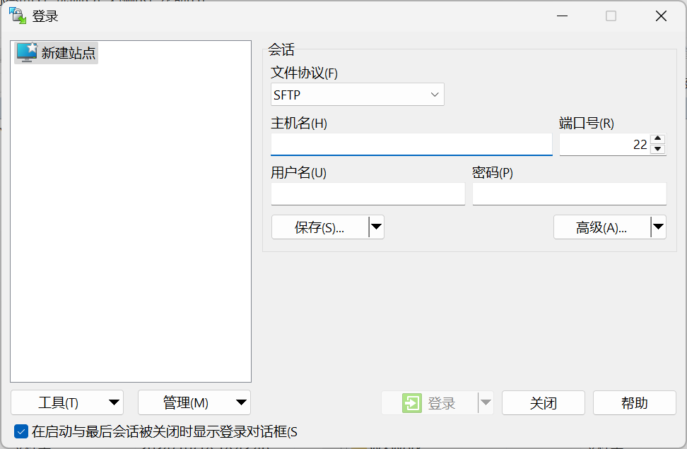
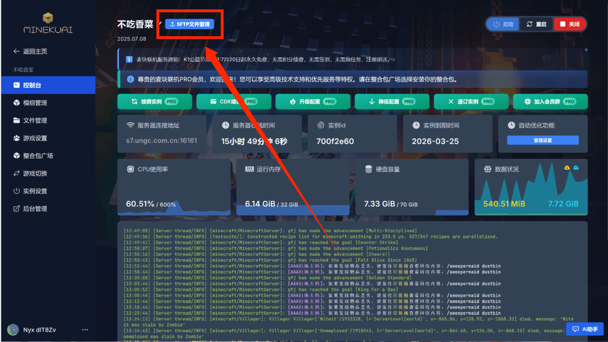
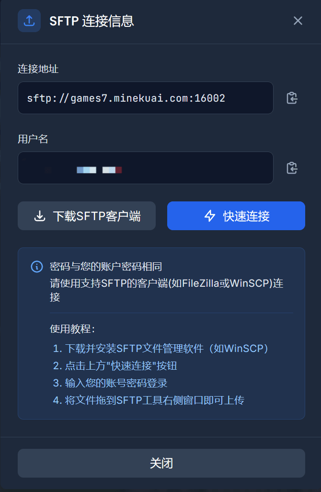
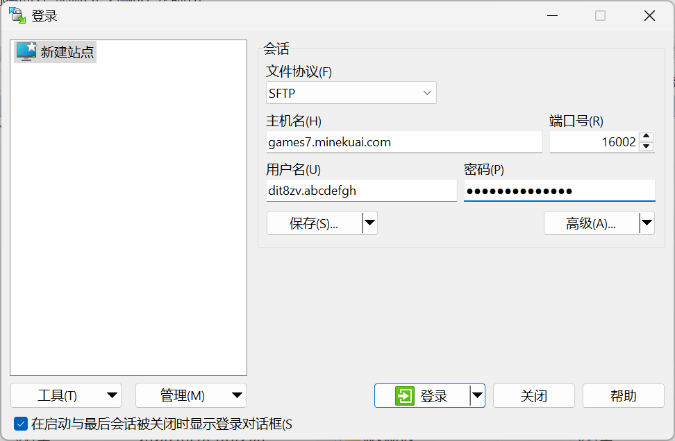
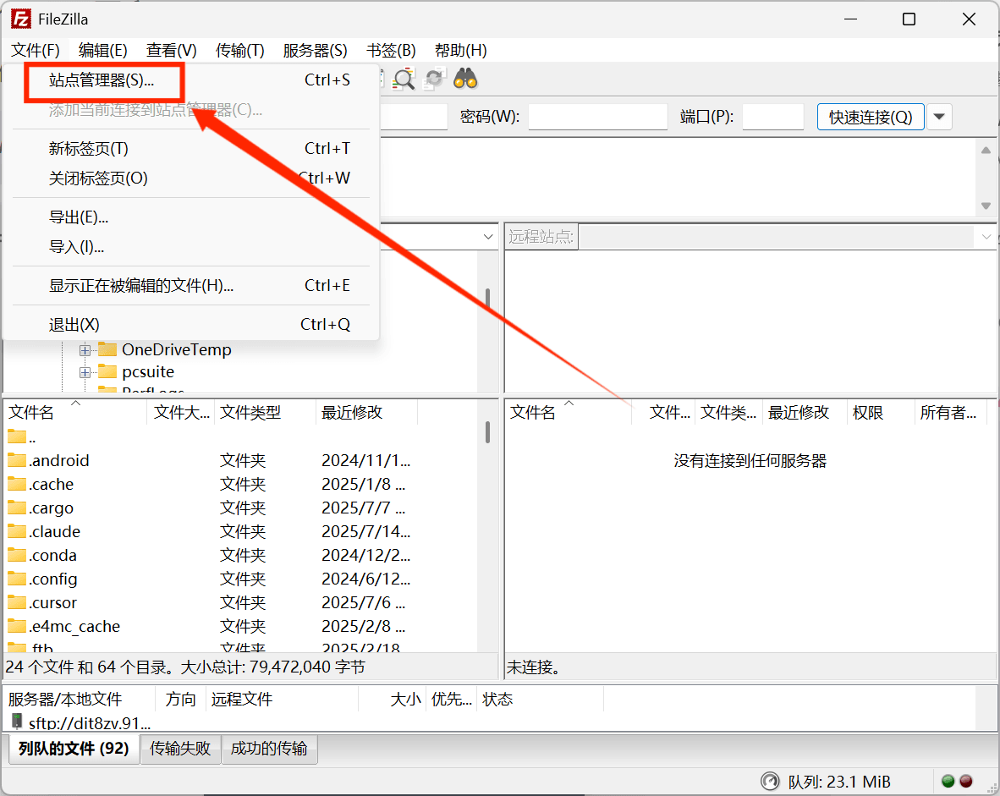
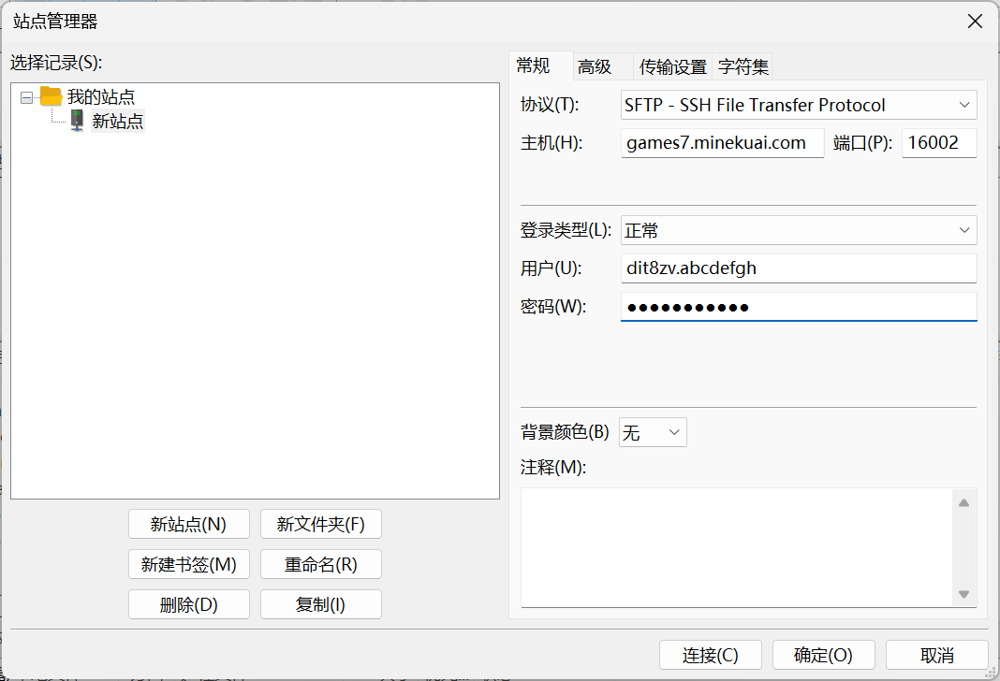

# 使用 SFTP 软件连接服务器

::: tip 概述
SFTP（SSH 文件传输协议）是通过加密方式传输文件的协议，用于安全地连接服务器进行上传、下载、管理操作。
:::

## 基本信息（通用配置）

::: tip 
详细信息可查看👉 [如何上传文件](../upload)
:::

| 项目     | 内容                  |
|----------|-----------------------|
| 主机     | `xxx.minekuai.com` |
| 端口     | `xxxxx` |
| 协议     | `SFTP`                  |
| 用户名   | `用户名.实例id`             |
| 密码 / 密钥 | `您的网站登录密码` |

## Windows 用户

推荐使用：**WinSCP** 或 **FileZilla**

::: details WinSCP 使用教程

1. 下载 WinSCP：
   - [官方下载](https://winscp.net/eng/download.php)
   - <a href="/src/WinSCP-6.5.2-Setup.exe" target="_blank" download>镜像下载</a>

2. 安装后，打开 WinSCP，第一次启动会弹出登录界面
   

     
   

3. 打开您的实例控制台界面，点击左上角`SFTP文件管理` 按钮

  
  

4. 复制连接信息

  

5. 填写连接信息 ：

 - 文件协议：SFTP

 - 主机名：games7.minekuai.com

 - 端口号：16002

 - 用户名：dit8zv.abcdefgh

 - 密码：您的网站登录密码

6. 点击【登录】，首次连接会提示确认指纹，点击【是】

7. 成功连接后左侧为本地，右侧为服务器，拖拽即可上传/下载
:::

::: details FileZilla 使用教程（适用于 Windows/macOS）

1. 下载 FileZilla：
 - [官方下载](https://filezilla-project.org/download.php?show_all=1)   
  - <a href="/src/FileZilla_3.69.2_win64_sponsored2-setup.exe" target="_blank" download>镜像下载</a>

2. 打开 FileZilla，点击【文件】 → 【站点管理器】 → 【新站点】

  

3. 打开您的实例控制台界面，点击左上角`SFTP文件管理` 按钮

  
  

4. 复制连接信息

  

5. 填写连接信息：

 - 文件协议：SFTP

 - 主机名：games7.minekuai.com

 - 端口号：16002

 - 用户名：dit8zv.abcdefgh

 - 密码：您的网站登录密码

  

6. 点击【连接】，如首次连接会提示确认指纹，点击【确定】
:::

## MacOS 用户

推荐使用：[**FileZilla**](./sftp.html#windows-用户)

### FileZilla（详见上文）

使用方式与 Windows 相同

## Android 用户

推荐使用：**Solid Explorer**

### Solid Explorer 使用教程

1. 下载 Solid Explorer：
   - Google Play 或国内如酷安下载

2. 打开 → 左上角菜单 → 存储管理器 → 添加存储

3. 选择【SFTP】，输入信息：
   - 主机：xxx.minekuai.com
   - 用户名 / 密码

4. 成功后可通过图形界面上传/下载文件

## iOS 用户

推荐使用：**FE File Explorer**

### FE File Explorer 使用教程

1. App Store 搜索并安装 `FE File Explorer`

2. 打开后，点击右上角 ➕ 添加 → SFTP

3. 填写以下信息：
   - 服务器：xxx.minekuai.com
   - 端口：xxxxx
   - 用户名 / 密码

4. 保存并连接即可使用

## 🧠 常见问题

| 问题        | 解决方案                                         |
|-------------|--------------------------------------------------|
| 无法连接    | 检查主机、端口、用户名是否正确；网络是否正常         |
| 密码错误    | 确认密码拼写正确，注意大小写                        |
| 权限不足    | 说明该账号无权访问某目录，请联系管理员               |
| 上传失败    | 检查文件权限或服务器剩余空间                        |

如需进一步帮助，请联系客服或官方 Q 群留言反馈。
