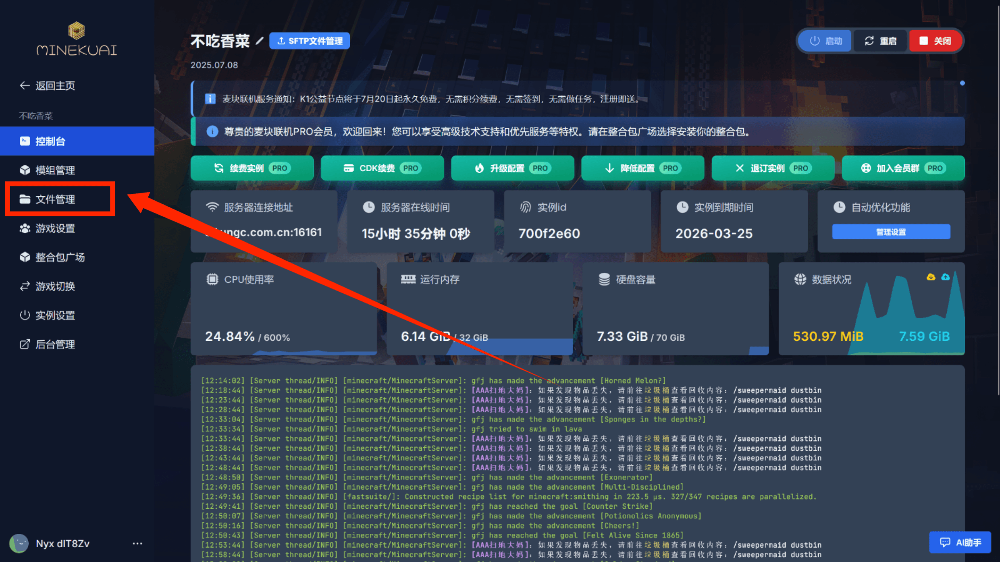
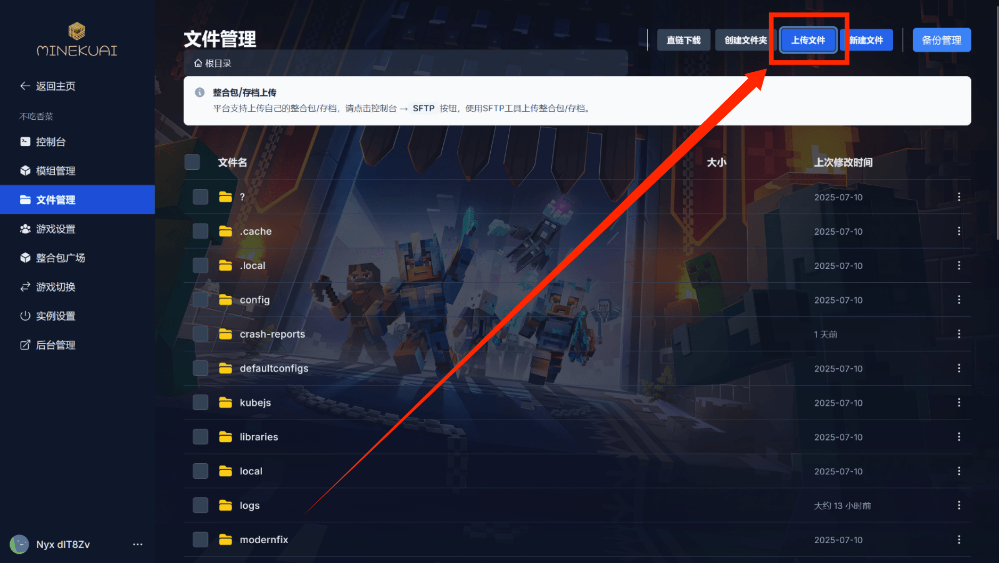
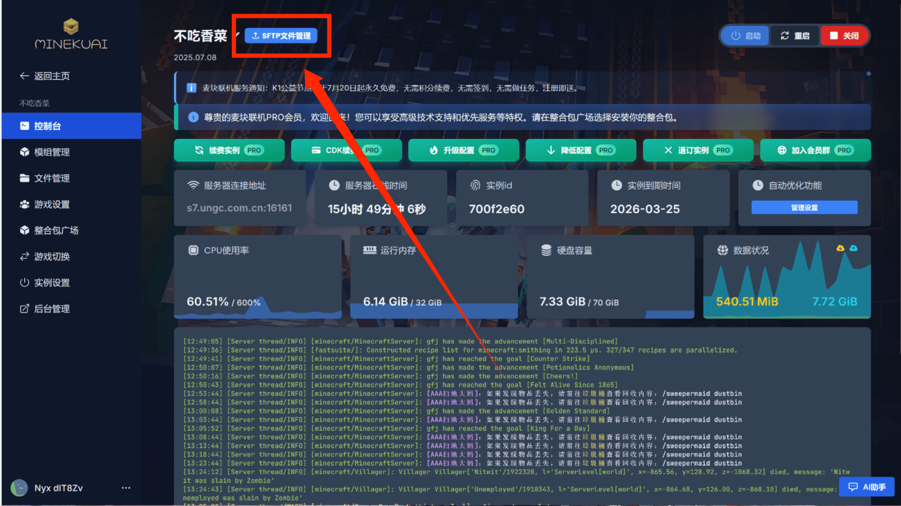
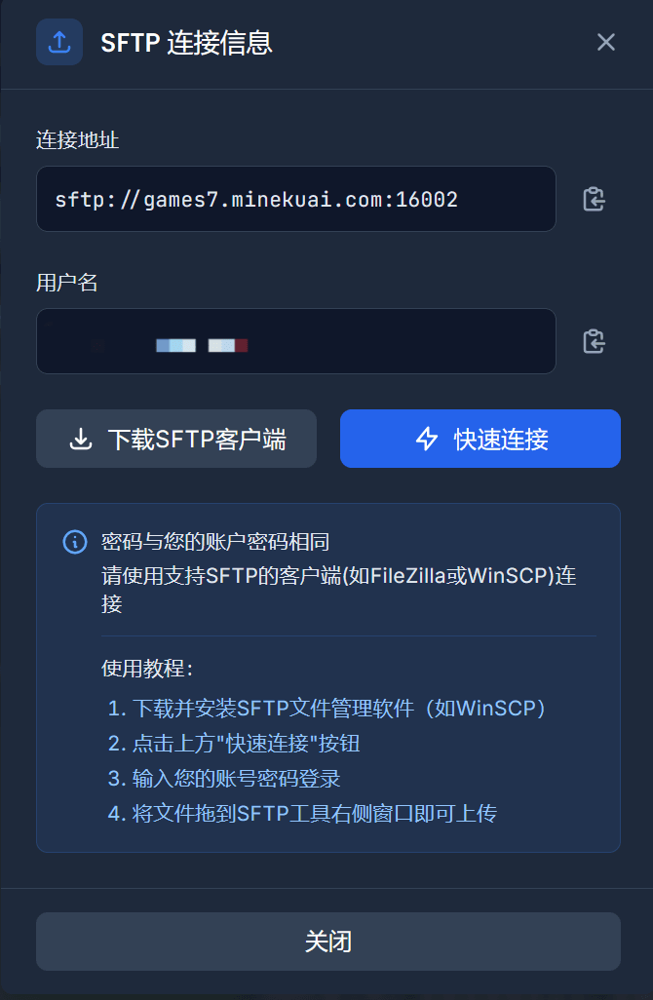

# 如何上传文件？

::: info 上传
我们提供多种上传方式，适用于不同大小的文件
:::

## 🔹 网页上传（适合小文件）

::: info 适用场景
适合上传 **小于 100 MB** 的文件，如配置文件、地图存档、插件等。
:::

::: details 详细步骤

**1. 登录控制面板**

  

**2. 进入文件管理**
在左侧菜单中选择"文件管理"

  

**3. 上传文件**
点击"上传文件"按钮或直接拖拽文件

  

:::

::: warning 注意事项
- 文件大小限制：100 MB
- 支持拖拽上传
- 建议压缩大文件后上传
:::
## 🔸 SFTP 上传大文件（推荐）

::: tip 提示
对于 **大于 100 MB** 的文件（如大型模组包、整合包地图等），请使用支持 SFTP 的工具（如 FileZilla）进行上传。
:::

### 🛠 操作步骤

#### 📥 第一步：准备工具
下载并安装 FileZilla 客户端：
- [官网下载](https://filezilla-project.org/)
- <a href="/src/FileZilla_3.69.2_win64_sponsored2-setup.exe" target="_blank" download>镜像下载</a>
- 或使用其他 SFTP 客户端

#### 🔑 第二步：获取连接信息
1. 登录控制面板，进入目标实例
2. 点击实例名称左侧的 **"SFTP 文件管理"** 按钮

  

3. 记录以下连接参数：

  

::: info 连接参数说明
| 参数 | 说明 | 示例 |
|------|------|------|
| **主机名 (Host)** | 服务器地址 | `xxxx.minekuai.com` |
| **端口号 (Port)** | 主机名后的数字 | `25565` |
| **用户名 (Username)** | 用户名.实例ID | `dit8zv.abcdefgh` |
| **密码 (Password)** | 站点登录密码 | （您的密码）|
:::

#### 🌐 第三步：建立连接
在 FileZilla 中填写上述信息，点击"快速连接"进入服务器文件系统。

#### 📤 第四步：上传文件
将文件拖入对应目录，即可完成上传。

::: danger 重要提醒
✅ 上传完成后，请确认文件路径无误，并在控制面板中进行必要的设置或解压操作。
:::

::: tip 需要帮助？
❓ 操作有疑问？查看详细教程：[SFTP 使用指南](./faq/sftp)
:::

> 💡 **故障排除**：如遇上传失败、连接中断等问题，请检查网络连接或联系客服获取帮助。